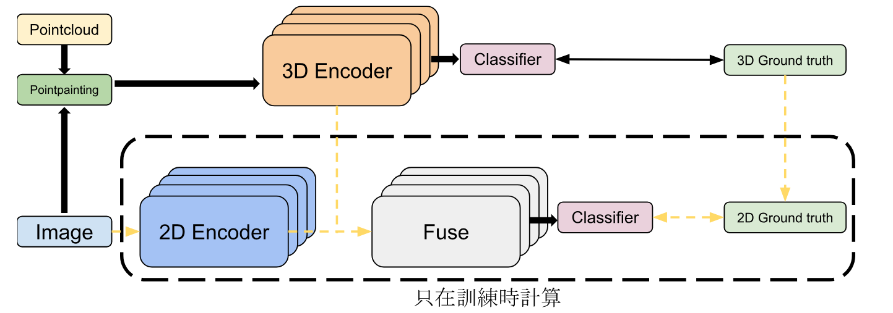
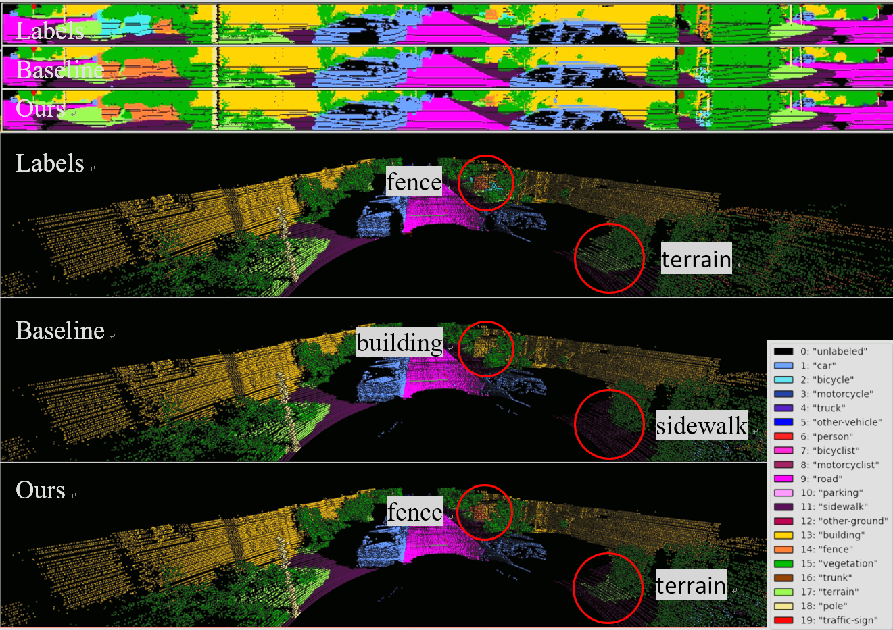
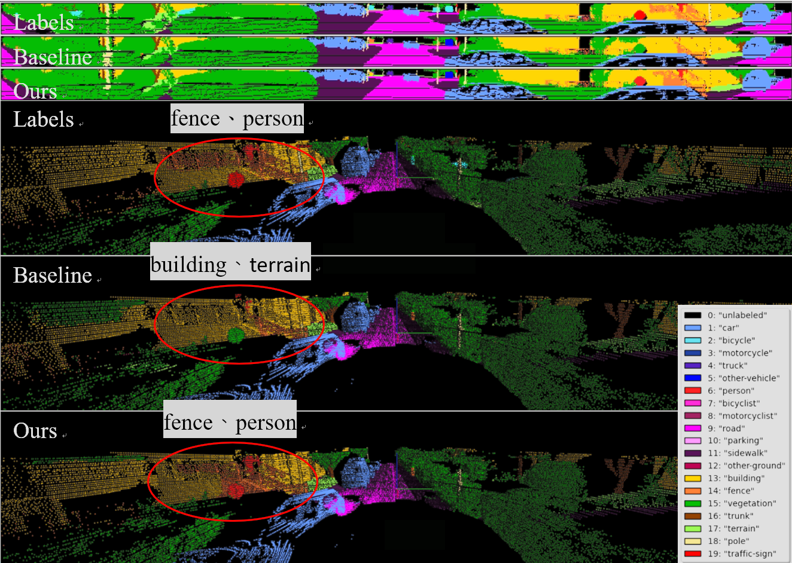
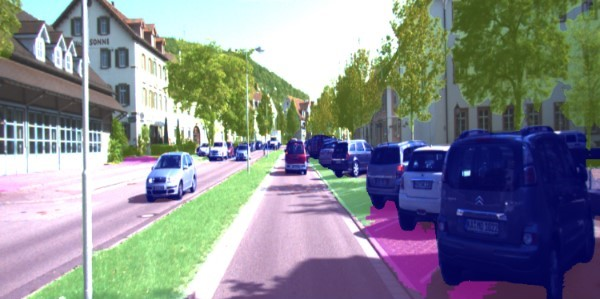
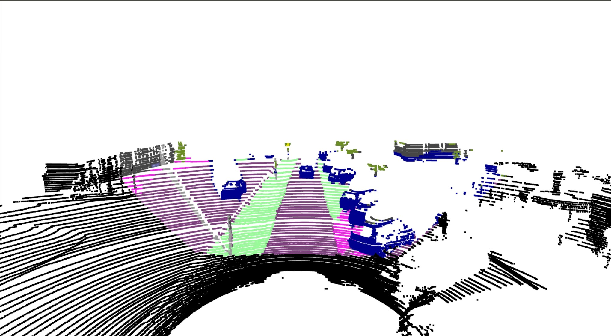

# dualfuse


## Architecture
<p align="center">
    
</p>

## Visualize
<p align="center">
   
    
</p>

## Installation
### Requirements
- pytorch >= 1.8 
- yaml
- easydict
- pyquaternion
- [lightning](https://github.com/Lightning-AI/lightning) (tested with pytorch_lightning==1.3.8 and torchmetrics==0.5)
- [torch-scatter](https://github.com/rusty1s/pytorch_scatter) (pip install torch-scatter -f https://data.pyg.org/whl/torch-1.9.0+${CUDA}.html)
- [nuScenes-devkit](https://github.com/nutonomy/nuscenes-devkit) (optional for nuScenes)
- [spconv](https://github.com/traveller59/spconv) (tested with spconv==2.1.16 and cuda==11.1, pip install spconv-cu111==2.1.16)
- [torchsparse](https://github.com/mit-han-lab/torchsparse) (optional for MinkowskiNet and SPVCNN. sudo apt-get install libsparsehash-dev, pip install --upgrade git+https://github.com/mit-han-lab/torchsparse.git@v1.4.0)
- torch_geometric==1.7.2
- tensorboard
- timm
- termcolor
- tensorboardX

### The Thirdparty Folder Data
- You can download the essential file from[here](https://github.com/dvlab-research/SphereFormer/tree/master/third_party/SparseTransformer).
- Than follow the README.md file of SpTr: PyTorch Spatially Sparse Transformer Library to set up the envionment.

## Data Preparation

### SemanticKITTI Dataset
Please download the files from the [SemanticKITTI website](http://semantic-kitti.org/dataset.html) and additionally the [color data](http://www.cvlibs.net/download.php?file=data_odometry_color.zip) from the [Kitti Odometry website](http://www.cvlibs.net/datasets/kitti/eval_odometry.php). Extract everything into the same folder.
```
./dataset/
├── 
├── ...
└── SemanticKitti/
    ├──sequences
        ├── 00/           
        │   ├── velodyne/	
        |   |	├── 000000.bin
        |   |	├── 000001.bin
        |   |	└── ...
        │   └── labels/ 
        |   |   ├── 000000.label
        |   |   ├── 000001.label
        |   |   └── ...
        |   └── image_2/ 
        |   |   ├── 000000.png
        |   |   ├── 000001.png
        |   |   └── ...
        |   calib.txt
	.
	.
	.
        ├── 08/ # for validation
        ├── 09/
        ├── 10/
        ├── 11/ # 11-21 for testing
        └── 21/
	    └── ...
```
### Data preprocessing
<p align="center">
    
</p>
<p align="center">
    
</p>

- The method I used involves projecting the semantic segmentation results of RGB images onto the point cloud using the [PointPainting](https://github.com/AmrElsersy/PointPainting) approach. This process enhances the original point cloud vectors from `𝑥,𝑦,𝑧,𝑡`to `𝑥,𝑦,𝑧,𝑡,𝑠𝑒𝑚`, and the enhanced data is saved in the sem_velodyne folder. If any modifications are needed, I have annotated the relevant sections in `/dataloader/pc_dataset.py` with `##sem_` comments.

## Training

```shell script
cd <dir path>
python main.py --log_dir 2DPASS_semkitti --config config/2DPASS-semantickitti.yaml --gpu 0
```
The output will be written to `logs/SemanticKITTI/2DPASS_semkitti` by default. 

## Testing

```shell script
cd <dir path>
python main.py --config config/2DPASS-semantickitti.yaml --gpu 0 --test --num_vote 12 --checkpoint <dir for the pytorch checkpoint>
```
The checkpoint path will be `logs/SemanticKITTI/2DPASS_semkitti` by default. 

## Acknowledgements
This code is built based on [2DPASS](https://github.com/yanx27/2DPASS/tree/main?tab=readme-ov-file),[PointPainting](https://github.com/AmrElsersy/PointPainting) and [SphereFormer](https://github.com/dvlab-research/SphereFormer).
